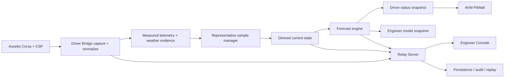
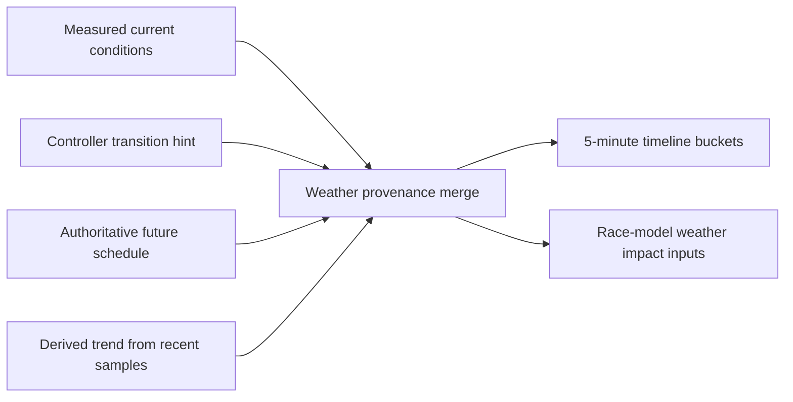
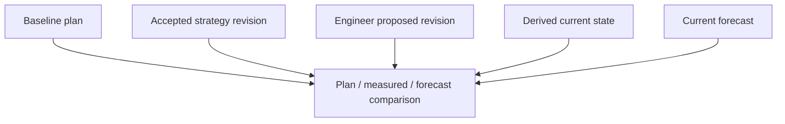

# Calculation Data Flow

Status: DRAFT

This document describes the planned end-to-end flow for measured race inputs,
derived current state, forecasts, weather evidence, and bounded driver-facing
outputs.

Related documents: [Data Flow](data-flow.md),
[Race Model And Forecast Engine](race-model-and-forecast-engine.md),
[Offline And Reconnect Model](offline-and-reconnect-model.md),
[Observability](observability.md),
[ADR-008](../decisions/ADR-008-live-calculation-ownership.md),
[ADR-009](../decisions/ADR-009-weather-source-provenance.md),
[ADR-010](../decisions/ADR-010-five-minute-weather-timeline.md), and
[ADR-011](../decisions/ADR-011-forecast-confidence-and-explanations.md).

## Planned End-To-End Flow

The Driver Bridge path is the low-latency authoritative path for live tactical
calculation. Relay Server receives the same measured and calculated evidence so
it can validate, persist, replay, and optionally recompute without making the
browser authoritative.

## Step 1: Capture And Normalize

Driver Bridge should capture and normalize:

- car-local telemetry
- session and identity context
- pit-state and lap-state changes
- current weather and track-condition measurements
- source metadata, capture time, monotonic time, and sequence

Normalization rules:

- convert every quantity to canonical units before downstream calculation
- attach session, car, driver, track, and layout identity at ingestion time
- reject or quarantine wrong-session and wrong-car inputs before they enter the
  active model

## Step 2: Preserve Measured Inputs

Measured inputs remain first-class records. They should not be overwritten by
derived or forecast values. At minimum the model should preserve:

- current fuel
- current lap and lap time
- normalized track position
- speed and distance progression
- pit state
- tyre state where available
- current weather and current track condition

This layer is the evidence base for later calculations.

## Step 3: Build Compatible Sample Sets

`forecast-engine` should build representative sample sets from measured inputs.
Each sample should carry:

- operating regime
- freshness
- completeness
- compatibility with current session, track, layout, and strategy context
- weather and track-condition context

Samples should be excluded or downweighted when:

- the regime is incompatible with the requested model
- the sample is stale
- telemetry is incomplete
- the car is in pit lane or an out-lap when modelling green-flag race pace
- conditions changed materially between sample capture and current state

## Step 4: Produce Derived Current State

Derived current state is the bridge between raw evidence and future prediction.
It should include:

- rolling fuel burn by lap, distance, and time
- current stint identity and progress
- pace delta versus target
- distance and time to pit entry
- tyre degradation trend
- weather trend and track wetting/drying trend

Derived state must name:

- the sample set used
- the active operating regime
- the accepted strategy revision used for comparison
- the confidence and freshness of the output

## Step 5: Produce Forecast State

Forecast state should combine derived current state with the accepted strategy
revision and live assumptions to produce:

- predicted fuel at pit entry
- predicted fuel at stint end
- expected consumption for the next stint
- required fuel addition
- projected race-end fuel
- earliest, optimal, and latest safe pit points
- projected tyre life and crossover
- strategy feasibility and reserve risk

Forecast generation rules:

- always preserve the strategy revision reference
- always include uncertainty
- degrade confidence rather than extrapolating through missing evidence
- keep weather provenance explicit

## Step 6: Publish Two Snapshot Shapes

### Driver Status Snapshot

Driver-facing reduction should remain compact and bounded. It may include:

- current status and freshness
- one active recommendation
- selected fuel delta and pit timing cues
- next meaningful weather change
- confidence/provenance shorthand

AVM PitWall should not receive the entire engineer-detail model.

### Engineer Model Snapshot

Engineer-facing output may include:

- measured layer
- derived current state
- forecast state
- active and baseline strategy comparisons
- sample quality and exclusions
- confidence dimensions
- explanation and reason-code details

## Weather Evidence Flow

The weather merge layer must keep provenance explicit:

- `CURRENT` for measured present conditions
- `SCHEDULED` for authoritative future schedule
- `TRENDING` for recent observed direction
- `ESTIMATED` for AVM model output
- `UNKNOWN` for unsupported future claims
- `STALE` when freshness policy is violated

## Baseline And Revision Flow

Rules:

- baseline plan remains immutable reference state
- accepted revision drives live tactical forecasting
- proposed revisions are compared, not silently activated
- forecast snapshots must say which revision they are based on

## Relay-Side Reuse

Relay Server may:

- validate incoming measured and calculated state
- persist model revisions, explanations, and sample references
- replay prior inputs through the same shared packages
- run longer-horizon or alternative-plan calculations

Relay Server must not:

- silently reinterpret the browser's local state as authoritative
- discard bridge-produced provenance when recomputing
- collapse measured and recomputed outputs into one unlabeled stream

## Freshness And Failure Handling

- If live capture pauses, derived and forecast state should transition through
  `degraded`, `stale`, and `disconnected` per the repository freshness model.
- If the bridge is offline from the relay, local calculation and driver
  snapshots may continue while upstream publication is buffered or degraded.
- If weather future data disappears, the future timeline should degrade toward
  `UNKNOWN` or `STALE` instead of showing the old schedule as current truth.
- If session, car, track, or layout identity changes, the sample manager should
  invalidate incompatible rolling state rather than carrying it over.

## Observability Expectations

Operators and support tooling should be able to inspect:

- source freshness
- sample counts and rejection reasons
- active regime
- forecast revision basis
- confidence degradation causes
- whether a value is measured, derived, forecast, scheduled, estimated,
  trending, unknown, or stale

## Out Of Scope

- Exact transport framing for the snapshot payloads.
- Persistence table schemas.
- Browser chart layout and interaction design.
