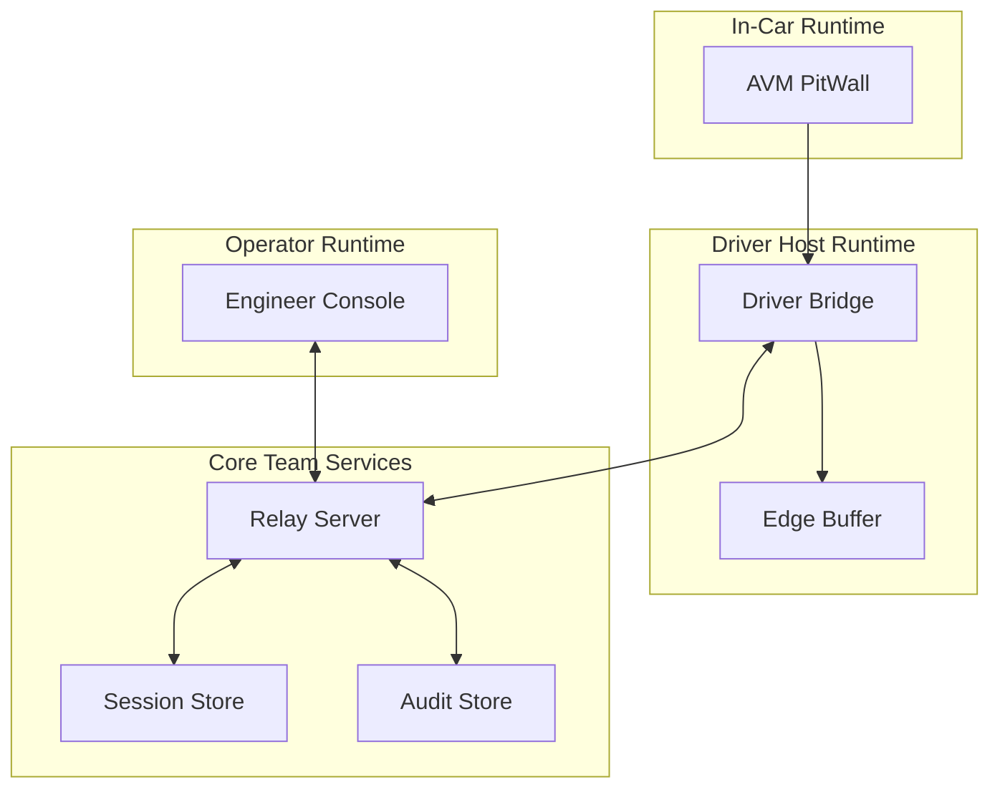

# AVM Race Engineer Component Boundaries

Status: DRAFT

This document proposes the F0 logical component boundaries for AVM Race
Engineer. It defines ownership lines, allowed responsibilities, and the trust
expectations that should hold between subsystems.

Related documents: [System Context](system-context.md),
[Data Flow](data-flow.md), [Session And Identity Model](session-and-identity-model.md),
[Offline And Reconnect Model](offline-and-reconnect-model.md),
[Security Boundaries](../operations/security-boundaries.md).

## Proposed Component Map

## Proposed Responsibility Boundaries

### AVM PitWall

- Render a bounded driver-facing view model.
- Display current status, acknowledgements, and compact prompts.
- Avoid becoming the source of truth for session history or authorization.

### Driver Bridge

- Collect telemetry from the local runtime.
- Manage edge connectivity, buffering, and reconnect sequencing.
- Present a single driver-host identity to the relay for the active session.
- Avoid embedding team-wide authorization policy or long-lived control-plane
  state.

### Relay Server

- Act as the proposed authority for session truth, command validation,
  authorization checks, and state fan-out.
- Mediate every engineer-originated command before it can become
  driver-visible.
- Persist auditable state transitions and enough session context for browser
  recovery.

### Engineer Console

- Provide operator-facing telemetry, strategy inputs, and acknowledgements.
- Surface freshness and degraded-state warnings explicitly.
- Avoid directly contacting edge devices without relay mediation.

## Boundary Rules

- Driver-visible rendering should not depend on arbitrary remote layout data.
- Browser-visible truth should be derived from relay-side session state, not
  inferred independently by each tab.
- Edge buffering should be local to the driver host, not pushed into the
  in-car Lua surface.
- Audit storage should remain relay-mediated so operator actions and edge
  outcomes can be correlated.

## Proposed Integration Limits

| Boundary | Allowed exchange | Should be rejected |
| --- | --- | --- |
| PitWall to Bridge | bounded display state, local acknowledgement signals | remote templates, executable markup, unrestricted payloads |
| Bridge to Relay | versioned telemetry, session status, acknowledgements | unauthenticated commands, ambiguous identity state |
| Engineer Console to Relay | authenticated operator intent, view subscriptions | direct edge mutation, bypass of authorization |
| Relay to Engineer Console | relay-derived truth, freshness, audit summaries | unlabelled stale data presented as live |

## Open F0 Boundary Questions

- Whether the relay should split command routing and telemetry fan-out into
  separate deployable services later.
- Whether audit and telemetry storage can share the same persistence engine in
  F0 without weakening recovery guarantees.
