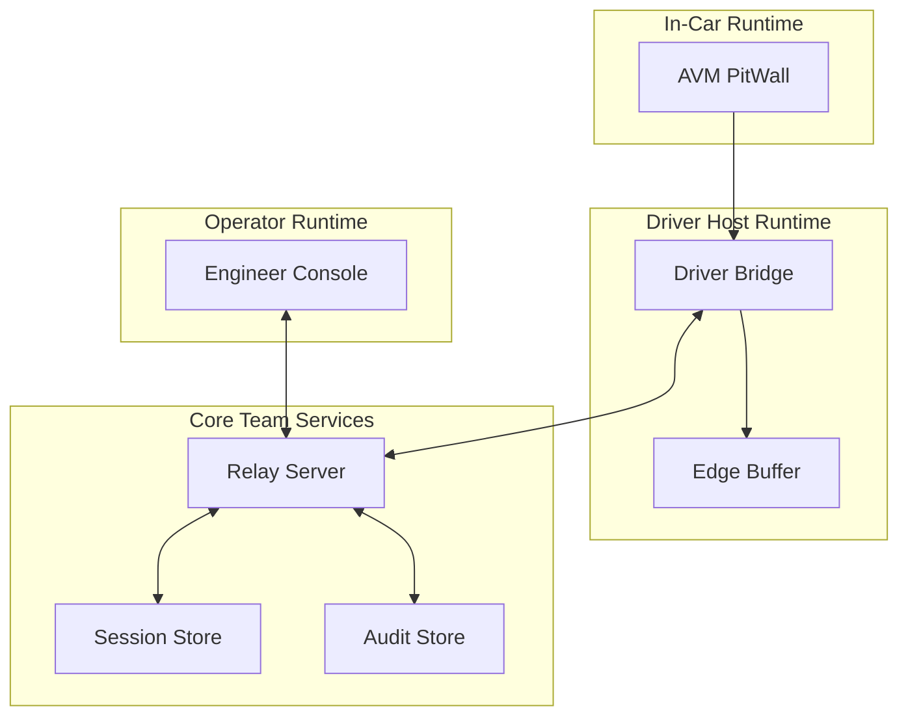

# AVM Race Engineer Component Boundaries

Status: DRAFT

This document proposes the F0 logical component boundaries for AVM Race
Engineer. It defines ownership lines, allowed responsibilities, and the trust
expectations that should hold between subsystems.

Related documents: [System Context](system-context.md),
[Data Flow](data-flow.md), [Session And Identity Model](session-and-identity-model.md),
[Offline And Reconnect Model](offline-and-reconnect-model.md),
[Security Boundaries](../operations/security-boundaries.md).

## Proposed Component Map

## Proposed Responsibility Boundaries

### AVM PitWall

- Render a bounded driver-facing view model from a compact driver snapshot.
- Display current status, acknowledgements, compact prompts, and only the
  weather or strategy implications that are safe to show while driving.
- Retain only the minimal fallback state needed to remain safe when upstream
  updates become stale or disconnected.
- Avoid becoming the source of truth for session history or authorization.
- Avoid reproducing the full race-model, forecast, or scenario engine in Lua.

### Driver Bridge

- Collect telemetry from the local runtime.
- Manage edge connectivity, buffering, and reconnect sequencing.
- Present a single driver-host identity to the relay for the active session.
- Own the authoritative low-latency production calculation path for the active
  car, including representative-sample management, derived current state,
  short-horizon forecast, and compact driver snapshot production.
- Keep measured telemetry, derived current state, forecast state, and
  recommendation state as distinct outputs with explicit provenance.
- Avoid embedding team-wide authorization policy or long-lived control-plane
  state.

### Relay Server

- Act as the proposed authority for session truth, command validation,
  authorization checks, and state fan-out.
- Mediate every engineer-originated command before it can become
  driver-visible.
- Persist auditable state transitions and enough session context for browser
  recovery.
- Validate bridge-side calculation identity, compatibility, and strategy
  revision before promoting state as relay-visible truth.
- Optionally recompute or verify calculations with the same shared production
  libraries, then host longer-horizon scenario comparison and explanation
  capture without shifting low-latency ownership into the browser.

### Engineer Console

- Provide operator-facing telemetry, strategy inputs, scenario requests, and
  acknowledgements.
- Surface freshness and degraded-state warnings explicitly.
- Visualize measured state, calculated state, assumptions, confidence, weather
  provenance, and revision comparisons.
- Avoid directly contacting edge devices without relay mediation.
- Avoid becoming the authoritative owner of production calculations or strategy
  truth.

## Proposed Shared Domain Package Boundaries

- `packages/race-domain` should own typed units, session and car identity,
  strategy and stint identity, immutable plan or revision records, validation
  rules, and reason-code vocabulary shared across runtimes.
- `packages/forecast-engine` should own sample classification, operating-regime
  handling, outlier-resistant current-state calculation, short-horizon
  forecasting, confidence modeling, uncertainty, and explanation generation.
- `packages/strategy-simulation` should own longer-horizon scenario comparison,
  alternative pit or tyre plans, and sensitivity analysis that can run outside
  the bridge hot path.

## Boundary Rules

- Driver-visible rendering should not depend on arbitrary remote layout data.
- Browser-visible truth should be derived from relay-side session state, not
  inferred independently by each tab.
- Edge buffering should be local to the driver host, not pushed into the
  in-car Lua surface.
- Audit storage should remain relay-mediated so operator actions and edge
  outcomes can be correlated.
- Baseline strategy, accepted revision, live forecast, and proposed revision
  should remain separate records across all boundaries.
- Bridge and relay may share the same production domain libraries, but Lua and
  browser surfaces should not fork their own authoritative calculation models.

## Proposed Integration Limits

| Boundary | Allowed exchange | Should be rejected |
| --- | --- | --- |
| PitWall to Bridge | bounded driver snapshot state, local acknowledgement signals, predefined issue reports | remote templates, executable markup, unrestricted payloads |
| Bridge to Relay | versioned measured telemetry, derived state, forecast snapshots, provenance, acknowledgements | unauthenticated commands, ambiguous identity state, browser-authored authoritative calculations |
| Engineer Console to Relay | authenticated operator intent, proposed revisions, scenario requests, view subscriptions | direct edge mutation, bypass of authorization, silent acceptance of a proposed revision |
| Relay to Engineer Console | relay-derived truth, revision comparisons, weather provenance, confidence, audit summaries | unlabelled stale data presented as live, browser-only strategy truth |

## Open F0 Boundary Questions

- Whether the relay should split command routing and telemetry fan-out into
  separate deployable services later.
- Whether audit and telemetry storage can share the same persistence engine in
  F0 without weakening recovery guarantees.
