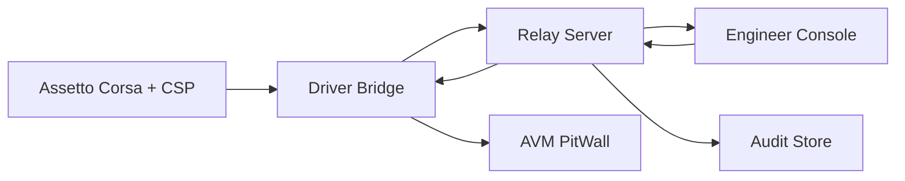

# AVM Race Engineer Data Flow

Status: DRAFT

This document proposes the F0 telemetry, command, acknowledgement, and audit
flows for AVM Race Engineer.

Related documents: [System Context](system-context.md),
[Component Boundaries](component-boundaries.md),
[Session And Identity Model](session-and-identity-model.md),
[Offline And Reconnect Model](offline-and-reconnect-model.md),
[Observability](observability.md).

## Proposed End-To-End Flow

## Proposed Telemetry Path

1. The local game runtime produces telemetry and session-state inputs.
2. `Driver Bridge` normalizes those inputs into versioned measured-telemetry
   and weather-measurement contracts bound to session, car, driver, track, and
   layout identity.
3. The bridge classifies representative samples, calculates derived current
   state, and emits short-horizon forecast plus recommendation state without
   overwriting the baseline plan or accepted strategy revision.
4. The bridge publishes a compact driver snapshot locally to `AVM PitWall`,
   forwards measured and calculated events to the `Relay Server`, and buffers
   upstream traffic when connectivity is unavailable.
5. The relay validates identity and strategy-revision compatibility, optionally
   recomputes or verifies calculations with the same shared domain libraries,
   and derives longer-horizon scenarios when enough data exists.
6. The relay fans out relay-validated session truth and richer engineer-model
   snapshots to subscribed engineer clients.
7. The relay records enough event context for later audit, replay, and
   forecast-versus-actual recovery analysis.

## Proposed Race-Model Data Layers

| Layer | Typical owner | Purpose | Must remain separate from |
| --- | --- | --- | --- |
| measured telemetry | Driver Bridge | direct observations such as fuel, lap, position, tyre, and current weather values | derived or forecast values |
| derived current state | Driver Bridge | current stint state, rolling pace or fuel models, pit-entry distance, and trend calculations | raw measurements and recommendations |
| forecast state | Driver Bridge hot path, Relay Server scenario path | predicted fuel, pit windows, stint end, weather impact, and feasibility | current-state facts and accepted revisions |
| recommendation state | Driver Bridge for compact driver output, Relay Server for engineer-visible alternatives | actionable statuses such as on-plan, save fuel, box this lap, replan required, or low confidence | forecasts presented as pure facts |

## Proposed Strategy Revision And Forecast Path

1. A baseline pre-race plan is stored as a stable reference record.
2. The current accepted strategy revision is distributed to the bridge and
   relay as the active decision context for calculations.
3. The bridge tags every derived-state and forecast output with the strategy
   revision and model version it used.
4. Engineer-authored revisions remain proposed until they are accepted through
   relay-mediated workflow.
5. The relay exposes planned, measured, forecast, proposed, and accepted views
   side by side so operators can compare rather than infer overwrite behavior.

## Proposed Weather And Provenance Path

1. The bridge captures measured current weather and track-condition signals from
   proven local sources.
2. A controller-provided current-to-next transition remains a transition hint
   and cannot justify `SCHEDULED` or a clock ETA by itself; only a deliberately
   exposed future schedule may use the `SCHEDULED` label.
3. AVM-derived trend and estimated forecast outputs should be produced
   separately from authoritative schedule data.
4. The relay publishes five-minute engineer-facing weather buckets and compact
   driver-facing next-change summaries with source type, freshness, confidence,
   and uncertainty.
5. Missing future evidence should degrade to unknown future state instead of
   implying that every bucket is authoritative.

## Proposed Command Path

1. An authenticated engineer initiates an action in `Engineer Console`.
2. The web client sends intent to the `Relay Server`, not directly to the
   driver host.
3. The relay checks operator identity, authorization scope, command shape, and
   expiry metadata.
4. The relay dispatches only validated commands to the addressed bridge
   session.
5. The bridge converts the command into a bounded driver-facing local view
   model before delivery to `AVM PitWall`.

## Proposed Acknowledgement Path

1. Driver-visible acknowledgement originates from the in-car or edge side.
2. The bridge correlates the acknowledgement to the original command instance.
3. The bridge forwards the correlated acknowledgement to the relay.
4. The relay updates operator-visible command state and records the transition
   for audit.

## Proposed Data Classes

| Data class | Source | Consumer | F0 handling rule |
| --- | --- | --- | --- |
| measured telemetry | game / bridge | relay, Engineer Console | versioned, identity-bound, and freshness-scored |
| derived current state | bridge | relay, Engineer Console | provenance-tagged and strategy-revision-bound |
| forecast snapshot | bridge, optionally relay recompute | relay, Engineer Console | uncertainty-bearing and never baseline-overwriting |
| driver status snapshot | bridge | pitwall | compact, bounded, and safe for glance use |
| weather timeline | bridge plus relay publication | Engineer Console, compact summary to PitWall | provenance-labelled, bucketed, and confidence-scored |
| strategy revision record | engineer workflow / relay | bridge, Engineer Console | baseline, accepted, and proposed states remain distinct |
| command intent | Engineer Console | relay | authenticated and authorized before dispatch |
| driver prompt model | relay / bridge | pitwall | bounded template-driven payload only |
| acknowledgement | PitWall / bridge | relay, Engineer Console | correlated to command instance |
| audit event | relay | operators, diagnostics | append-oriented and attributable |

## Proposed Safety Rules

- A relay-side command should not become driver-visible without explicit expiry
  metadata.
- Telemetry delayed by reconnect should remain distinguishable from live stream
  traffic.
- Browser views should not compute authoritative session truth from partial
  local caches.
- Audit flow should capture both accepted and rejected command attempts.
- Incompatible operating regimes such as dry, wet, caution, traffic-affected,
  and pit-lane running should not be blended into one undifferentiated model.
- A forecast should always identify the accepted strategy revision, sample set,
  and weather provenance on which it depends.
