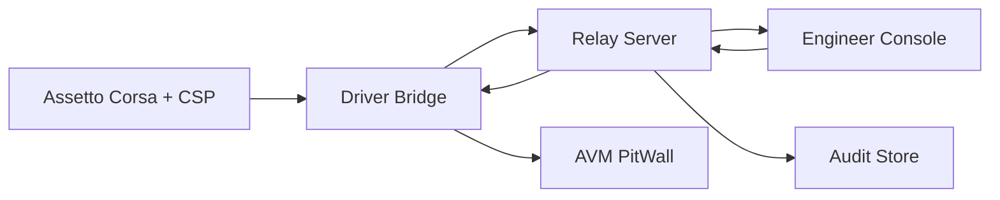

# AVM Race Engineer Data Flow

Status: DRAFT

This document proposes the F0 telemetry, command, acknowledgement, and audit
flows for AVM Race Engineer.

Related documents: [System Context](system-context.md),
[Component Boundaries](component-boundaries.md),
[Session And Identity Model](session-and-identity-model.md),
[Offline And Reconnect Model](offline-and-reconnect-model.md),
[Observability](observability.md).

## Proposed End-To-End Flow

## Proposed Telemetry Path

1. The local game runtime produces telemetry and session-state inputs.
2. `Driver Bridge` normalizes those inputs into a versioned platform contract.
3. The bridge forwards live events to the `Relay Server` and buffers them when
   upstream connectivity is unavailable.
4. The relay fans out relay-validated session truth to subscribed engineer
   clients.
5. The relay records enough event context for later audit and recovery.

## Proposed Command Path

1. An authenticated engineer initiates an action in `Engineer Console`.
2. The web client sends intent to the `Relay Server`, not directly to the
   driver host.
3. The relay checks operator identity, authorization scope, command shape, and
   expiry metadata.
4. The relay dispatches only validated commands to the addressed bridge
   session.
5. The bridge converts the command into a bounded driver-facing local view
   model before delivery to `AVM PitWall`.

## Proposed Acknowledgement Path

1. Driver-visible acknowledgement originates from the in-car or edge side.
2. The bridge correlates the acknowledgement to the original command instance.
3. The bridge forwards the correlated acknowledgement to the relay.
4. The relay updates operator-visible command state and records the transition
   for audit.

## Proposed Data Classes

| Data class | Source | Consumer | F0 handling rule |
| --- | --- | --- | --- |
| live telemetry | game / bridge | relay, Engineer Console | versioned and freshness-scored |
| command intent | Engineer Console | relay | authenticated and authorized before dispatch |
| driver prompt model | relay / bridge | pitwall | bounded template-driven payload only |
| acknowledgement | PitWall / bridge | relay, Engineer Console | correlated to command instance |
| audit event | relay | operators, diagnostics | append-oriented and attributable |

## Proposed Safety Rules

- A relay-side command should not become driver-visible without explicit expiry
  metadata.
- Telemetry delayed by reconnect should remain distinguishable from live stream
  traffic.
- Browser views should not compute authoritative session truth from partial
  local caches.
- Audit flow should capture both accepted and rejected command attempts.
