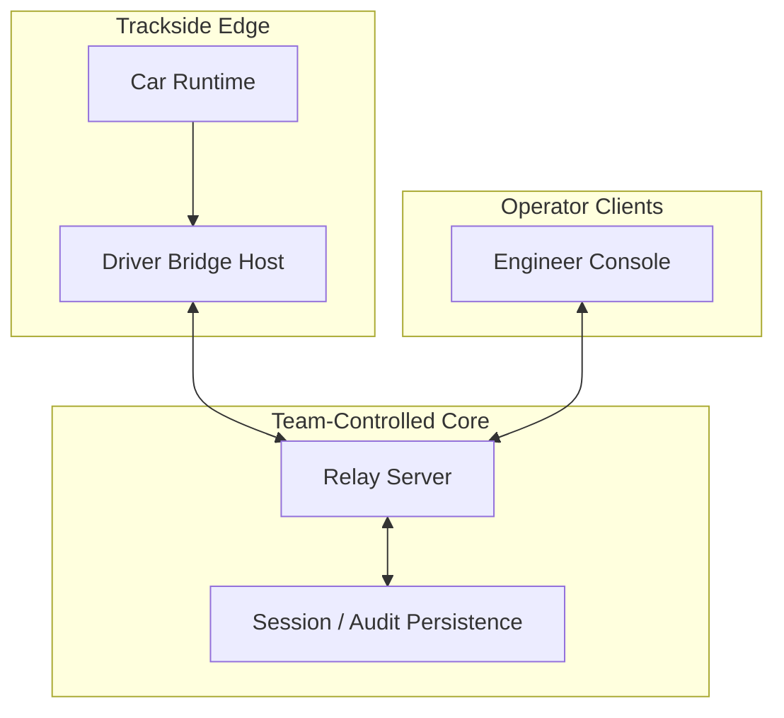

# AVM Race Engineer Deployment Topology

Status: DRAFT

This document proposes the F0 logical deployment topology for AVM Race
Engineer. It complements the operational deployment notes in
[On-Prem Deployment](../operations/on-prem-deployment.md).

Related documents: [System Context](system-context.md),
[Component Boundaries](component-boundaries.md),
[Offline And Reconnect Model](offline-and-reconnect-model.md),
[On-Prem Deployment](../operations/on-prem-deployment.md),
[Retention And Backups](../operations/retention-and-backups.md).

## Proposed Topology

## Proposed Placement Rules

- The bridge should run on a Windows host close to the game runtime.
- The relay should run on infrastructure controlled by the team and reachable
  from operator clients over the team network.
- Persistence should be treated as a core dependency for durable history and
  audit, even if limited degraded operation is possible without it.
- Browser clients should be treated as reconnecting consumers rather than
  durable data holders.

## Proposed Network Expectations

- Core race functionality should remain possible on a private team network
  without requiring public internet availability.
- Edge-to-core connectivity may be unstable and should be treated as a normal
  operating condition rather than an exceptional edge case.
- Operator clients may roam between networks, sleep, and resume; the relay
  should remain the authority during those transitions.

## Proposed Topology Risks

| Topology area | Risk | Proposed mitigation direction |
| --- | --- | --- |
| driver host to relay path | unstable edge uplink | local bridge buffering and reconnect sequencing |
| relay to persistence path | durable history unavailable | visible degraded mode and restricted claims of history |
| browser to relay path | stale tab state | forced freshness revalidation on reconnect |

## Later Design Questions

- Whether F0 should run the relay and persistence on one node or separate them.
- Whether a read-only observer surface is needed outside the full engineer console
  client.
