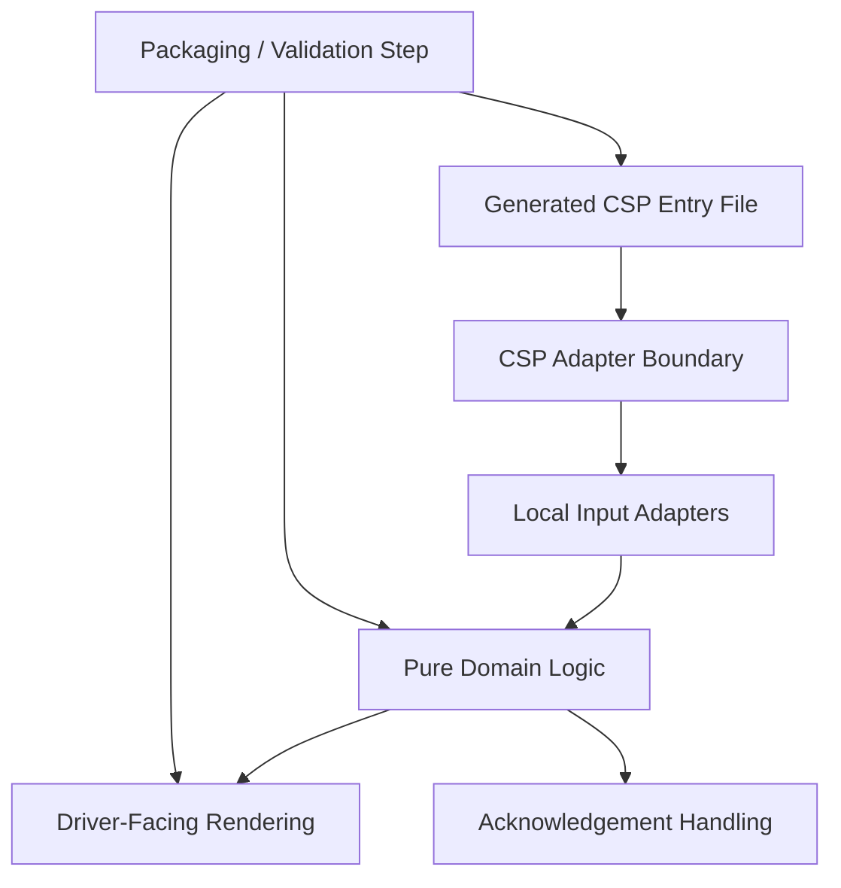
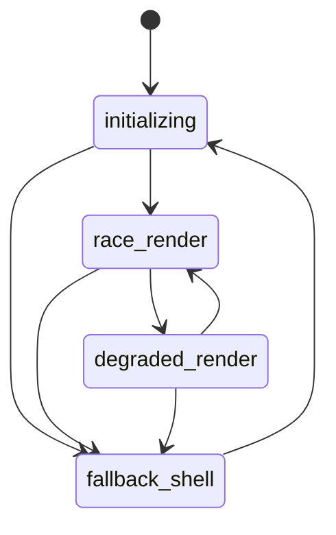

# AVM Race Engineer Lua Source And Build Architecture

Status: `F1 implemented; architecture retained for later runtime integration`

This document defines the source-structure and build-boundary expectations for
the `AVM PitWall` Lua surface. F1 implements the deterministic mock-only slice;
later phases may add validated transport adapters without moving transport
authority into the client.

Related documents: [System Context](system-context.md),
[Component Boundaries](component-boundaries.md),
[Data Flow](data-flow.md),
[Security Boundaries](../operations/security-boundaries.md),
[Support And Diagnostics](../operations/support-and-diagnostics.md).

## Proposed Source Boundary Goals

- Keep driver-facing Lua presentation logic separate from transport or relay
  authority logic.
- Preserve a narrow, testable local view-model boundary for everything rendered
  in-car.
- Allow build and packaging steps to enforce conservative asset and payload
  constraints before distribution.
- Keep the Lua codebase decomposed into small development modules while shipping
  one generated CSP entry artifact for runtime use.

## F1 implementation notes

The implementation lives in `apps/driver-lua/`. The explicit graph in
`build/module-manifest.json` orders 20 modules from `bootstrap` through `app`;
the bundler rejects duplicate IDs, missing dependencies, cycles, and missing
source files. Each source module is wrapped in a deterministic lexical block,
and `AVM_PitWall.lua` plus `script.lua` are generated outputs with source and
package hashes recorded in `build-manifest.json`.

The runtime namespace is `_G.AVM_PITWALL_F1`; the only callback global is the
required `windowMain` entry point. Direct `ui`, `rgbm`, `vec2`, `ac`, audio, and
storage access is confined to the adapter modules. The view model, formatter,
alert state machine, scenario catalog, and layout calculator accept bounded
inputs and do not perform networking or production race/weather calculations.

The release package contains no source fixtures or development modules. The
bundled asset manifest documents project ownership, licenses, dimensions,
runtime use, and fallback behavior for code-defined icons and generated tones.
The installer is separate from the bundler, dry-run by default, and refuses the
V1 target.

## Proposed Logical Layers

## Proposed Layer Responsibilities

### Local Input Adapters

- Consume edge-provided telemetry and command state that has already passed
  relay validation.
- Normalize local runtime quirks into stable internal fields.
- Remain the only layer that knows about CSP callback shapes or runtime-specific
  adapter details.

### Pure Domain Logic

- Hold deterministic, testable state transitions that do not depend on CSP
  globals or runtime callback registration.
- Avoid direct file-loading behavior such as runtime `require` or `dofile`.
- Depend on explicit inputs and namespaced configuration only.

### Bounded View Model

- Define the exact data shapes allowed to become driver-visible.
- Enforce string length limits, enumerated prompt types, and explicit fallback
  states.

### Driver-Facing Rendering

- Render compact, deterministic layouts from the bounded model.
- Avoid any mechanism that would effectively permit remote arbitrary UI
  composition.

### Packaging And Validation

- Validate that shipped Lua assets conform to expected structure.
- Reject accidental debug-only assets or uncontrolled payload tables before a
  build artifact is considered race-ready.
- Produce one generated CSP entry file from ordered source modules and treat
  that generated bundle as non-hand-edited output.

## Proposed Build Safety Rules

- Source layout should make it obvious which files are driver-visible versus
  host-only or tooling-only.
- Build packaging should prefer deterministic outputs so trackside operators can
  verify what was deployed.
- Diagnostics hooks in Lua should be bounded and removable for race builds.
- Development should happen in small modules with a deterministic dependency
  order captured by the build step.
- Runtime file loading via `require` or `dofile` should be disallowed in the
  shipped CSP artifact.
- The generated bundle should be the only CSP entry file loaded at runtime and
  should never be hand-edited.
- Configuration should be namespaced and treated as immutable during runtime;
  bare globals should be considered forbidden by default.
- The CSP adapter boundary should remain narrow so most logic stays in pure
  domain modules rather than callback-heavy runtime code.
- A main-chunk local-count gate should be used as a structural signal that the
  generated entry file is staying compact enough for review and runtime safety.
- Packaging should include a forbidden-pattern scan for banned globals,
  prohibited loaders, and obvious debug leftovers before a build is accepted.
- Production builds should provide callback and render fallbacks so missing or
  partial runtime inputs degrade visibly rather than crash silently.
- Race-ready packaging should include actual CSP validation against the built
  artifact, not only source-level inspection.

## Proposed Source And Bundle Constraints

| Concern | Proposed rule |
| --- | --- |
| development module size | prefer small focused modules with single-purpose boundaries |
| dependency ordering | build defines deterministic module order with no runtime discovery |
| runtime entry | one generated CSP entry file only |
| generated output ownership | generated bundle is never hand-edited |
| config style | namespaced immutable config, no bare globals |
| runtime loading | no runtime `require` or `dofile` in shipped artifact |
| adapter separation | CSP-specific callbacks isolated behind an adapter boundary |
| logic purity | domain state transitions remain pure where possible |
| structural gating | main-chunk local-count gate and forbidden-pattern scan |
| runtime safety | production callback/render fallback plus CSP validation |

## Proposed Validation Expectations

- Build validation should fail if source modules resolve in a non-deterministic
  order.
- Build validation should fail if banned loaders, path-sensitive file access, or
  bare global writes appear in the generated runtime artifact.
- Build validation should fail if the generated bundle diverges from expected
  CSP entry conventions or does not pass actual CSP-facing validation.
- Diagnostic-only helpers should be removable or gated so production bundles do
  not accidentally expose development behavior.

## Proposed Driver-Client Rendering Lifecycle

`fallback_shell` must always render product identity, failure stage, bounded
diagnostics, and connection state. No input failure may transition the client
to an invisible or blank state.

## Remaining runtime questions

- Which supported CSP release should be recorded as the F1 runtime baseline
  after the first interactive validation run.
- Whether CSP compatibility constraints require a stricter source-layout split
  between rendering and local state adapters once live callback evidence exists.
- Whether later package signing or deployment metadata should extend the
  current deterministic hash manifest.
