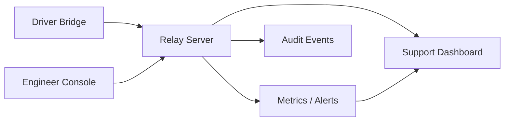

# AVM Race Engineer Observability

Status: DRAFT

This document proposes the F0 observability model for telemetry freshness,
operator actions, failures, and recovery state.

Related documents: [Data Flow](data-flow.md),
[Offline And Reconnect Model](offline-and-reconnect-model.md),
[Session And Identity Model](session-and-identity-model.md),
[Retention And Backups](../operations/retention-and-backups.md),
[Support And Diagnostics](../operations/support-and-diagnostics.md).

## Proposed Signal Categories

- `freshness`: event age, reconnect count, delayed replay state, buffer depth.
- `availability`: relay reachability, bridge session count, browser session
  health.
- `security`: failed authentication, authorization denials, identity mismatch.
- `safety`: expired-command suppression, duplicate-delivery suppression,
  view-model validation failures.
- `calculation-quality`: sample count, regime match, model version, confidence
  dimensions, and bridge-versus-relay divergence.
- `weather-source-health`: provider freshness, provider type, authoritative
  schedule presence, transition availability, and measured-versus-forecast
  conflicts.
- `audit`: operator actions, command state transitions, recovery milestones.

## Proposed Observability Flow

## Proposed Operator Signals

| Signal | Proposed operator meaning |
| --- | --- |
| `live` | current tactical decisions may proceed normally |
| `degraded` | data is still arriving but tactical confidence is reduced |
| `stale` | latest visible state is retained and should not be treated as current |
| `replaying` | delayed data is being reconciled after reconnect |
| `identity-mismatch` | edge or operator trust must be re-established before action |
| `low-confidence` | the system can explain a recommendation, but the sample or model quality is weak |
| `weather-unknown` | current weather may be known, but no trustworthy future weather claim is available |

## Proposed Alert Conditions

| Condition | Why it matters | Proposed response direction |
| --- | --- | --- |
| active session becomes `stale` | operators may act on old telemetry | warn prominently and restrict risky actions |
| reconnect storm on one bridge | edge path likely unstable | inspect buffer growth and fallback comms |
| repeated authorization rejection | role confusion or abuse | review actor, role, and session context |
| bounded view-model validation failure | unsafe driver payload path | stop forwarding that command class |
| missing acknowledgement with healthy relay | edge display or bridge issue | correlate dispatch, bridge state, and audit |
| missing strategy revision on a forecast | recommendation cannot be trusted or compared | reject promotion and surface provenance error |
| bridge and relay calculation divergence | operator may see conflicting race truth | flag the mismatch with model-version and sample-set context |
| weather provider becomes stale or contradictory | pit-window and tyre implications may be wrong | downgrade forecast confidence and mark future weather unknown |

## Proposed Instrumentation Rules

- Freshness state should be first-class and operator-visible.
- Audit events should capture both accepted and rejected command attempts.
- Recovery events should be distinguishable from ordinary live activity.
- Diagnostics should preserve enough correlation identifiers to trace a command
  from operator action to driver acknowledgement.
- Calculated values should log session, car, driver, track, layout, strategy
  revision, stint, model version, sample set, confidence components, and reason
  codes so forecast-versus-actual review is possible.
- Weather outputs should log source type, source age, schedule versus estimate
  provenance, bucket cadence, interpolation status, and fallback transitions to
  unknown or stale state.
