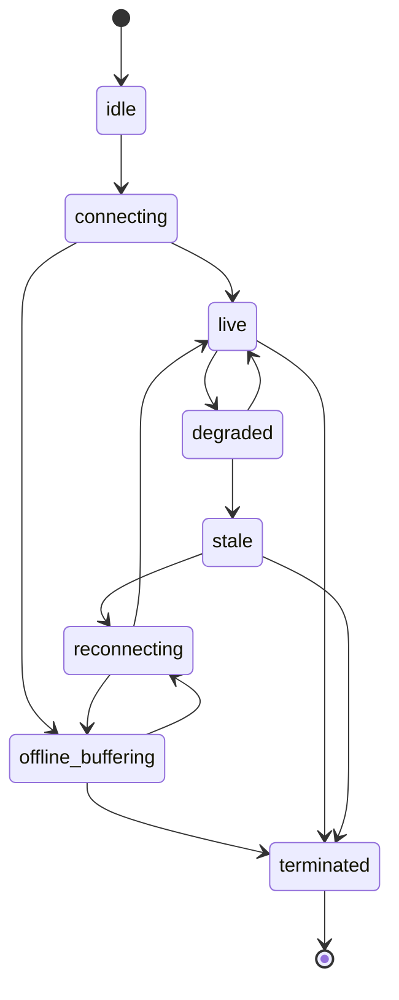
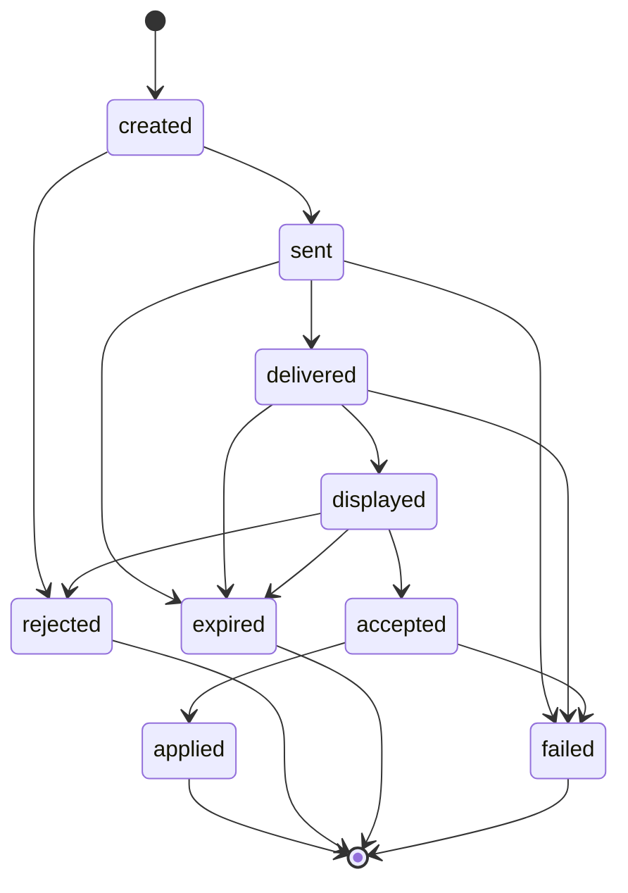
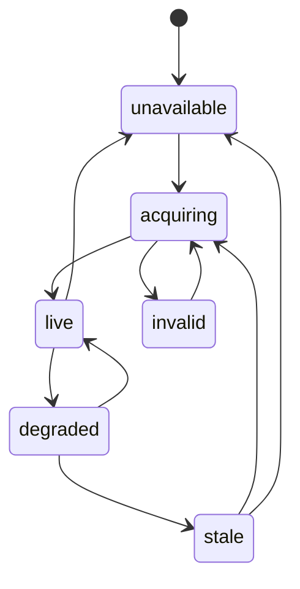

# AVM Race Engineer Offline And Reconnect Model

Status: DRAFT

This document proposes the F0 connection-state, offline buffering, and
reconnect behavior for AVM Race Engineer.

Related documents: [Data Flow](data-flow.md),
[Session And Identity Model](session-and-identity-model.md),
[Observability](observability.md),
[On-Prem Deployment](../operations/on-prem-deployment.md),
[Support And Diagnostics](../operations/support-and-diagnostics.md).

## Proposed Freshness States

- `live`: updates are arriving within the expected operating window.
- `degraded`: updates are present but delayed enough to reduce tactical
  confidence.
- `stale`: the last known view is retained, but new events have not arrived
  within the safe window.
- `disconnected`: the producing side is unreachable and live-action workflows
  should stop or warn aggressively.

## Proposed Connection State Machine

## Proposed Command Lifecycle Under Network Instability

These names are the canonical states from
[Command Lifecycle v0](../contracts/command-lifecycle-v0.md).

## Proposed Telemetry Availability Lifecycle

Every transition preserves source, capture time, sequence, session/car identity,
age, and validity. A retained value in `stale` remains visibly stale; it is not
silently promoted back to `live`.

## Proposed Offline Rules

- `Driver Bridge` should be the only component expected to buffer upstream
  telemetry during relay loss.
- `Driver Bridge` should continue representative-sample management, derived
  current-state calculation, short-horizon forecasting, and compact driver
  snapshot publication while the relay is unavailable.
- The bridge should retain the latest accepted strategy revision for local use
  during outage, but proposed or superseded remote revisions should not become
  implicitly accepted offline.
- Commands that expire during an offline interval should remain closed and must
  not become newly driver-visible after reconnect.
- Delayed replay should be marked as delayed until freshness returns to
  `live`.
- Browser clients should revalidate freshness after sleep or reconnect instead
  of assuming locally cached truth is current.
- When weather future data becomes stale or disappears, future weather should
  degrade to unknown or low confidence rather than persisting false precision.

## Proposed Reconnect Rules

- Reconnect should preserve event ordering metadata so delayed events remain
  distinguishable from fresh ones.
- Relay restart should not require restarting the game session on the driver
  host.
- Duplicate command or telemetry delivery during reconnect should be handled as
  a normal deduplication case, not as a unique exceptional path.
- Acknowledgements received after a relay outage should attach to the original
  command instance when correlation is still valid.
- Replayed calculated state should preserve the original strategy revision,
  model version, sample-set identity, and freshness markers used at calculation
  time.
- The relay may optionally recompute or verify buffered bridge calculations with
  the same shared production libraries after reconnect, but any divergence
  should remain visible instead of silently replacing the bridge history.
- Longer-horizon scenarios should be recalculated from the restored session
  truth once reconnect stabilizes, not inferred from a partially replayed
  browser cache.

## Proposed Local And Remote Behavior During Outage

- `AVM PitWall` should continue showing the last valid compact driver snapshot,
  mark it stale when freshness windows are exceeded, and suppress risky
  recommendations that can no longer be supported.
- `Driver Bridge` should remain the local authority for the active car's
  measured telemetry and short-horizon forecast while offline from the relay.
- `Relay Server` should treat post-outage replay as delayed evidence, then
  restore engineer-visible truth only after identity, ordering, and revision
  checks pass.
- `Engineer Console` should keep stale views visible for context, but block any
  UI that implies fresh authoritative calculation from a disconnected browser.

## Failure Cases To Preserve

- The driver host remains online to the game while offline from the relay.
- The relay restarts while operator clients remain open.
- A browser tab resumes from sleep with an apparently recent but actually stale
  cache.
- A command is dispatched near expiry while the uplink is unstable.
- The active weather provider changes or loses future schedule visibility during
  a session.
- The bridge reconnects with buffered calculations tied to an older accepted
  strategy revision.
