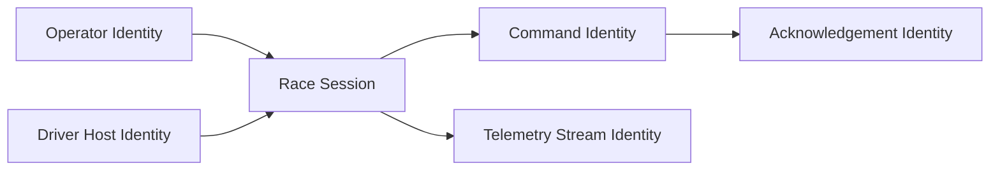
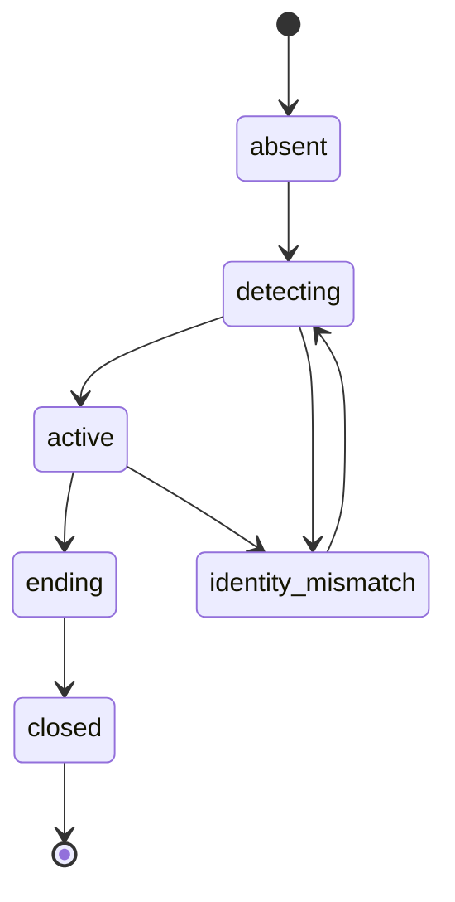

# AVM Race Engineer Session And Identity Model

Status: DRAFT

This document proposes the F0 model for session authority, operator identity,
and driver-host identity across AVM Race Engineer.

Related documents: [Component Boundaries](component-boundaries.md),
[Data Flow](data-flow.md), [Offline And Reconnect Model](offline-and-reconnect-model.md),
[Security Boundaries](../operations/security-boundaries.md),
[Support And Diagnostics](../operations/support-and-diagnostics.md).

## Proposed Identity Domains

- `driver-host identity`: the bridge-side identity representing a specific edge
  machine in a race session.
- `operator identity`: the authenticated human actor using `Engineer Console`.
- `session identity`: the active race or stint context against which telemetry,
  commands, and audit events are correlated.
- `car and driver identity`: the selected car entry and active driver that own
  the measured and calculated state stream.
- `track and layout identity`: the circuit and layout context required for lap,
  pit-entry, and weather compatibility.
- `strategy identity`: the baseline strategy and its accepted or proposed
  revisions.
- `stint identity`: the current stint instance within a strategy timeline.
- `command identity`: the unique instance identifier for a driver-visible
  action, including expiry and acknowledgement state.
- `calculation identity`: the model version, sample set, operating regime, and
  assumptions used to produce a derived or forecast value.

## Proposed Identity Relationships

## Proposed Authority Rules

- The relay should be the authority for binding operator actions to the active
  race session.
- The relay should validate that a bridge connection is associated with the
  intended driver-host identity before accepting session data as authoritative.
- Command issuance should always be attributable to one operator identity, even
  when multiple browser tabs are active.
- The bridge should correlate acknowledgements to existing command identities
  rather than minting independent driver-visible command state.
- The bridge should bind every measured, derived, and forecast value to the
  active session, car, driver, track, layout, strategy revision, and stint
  identity before it can be treated as tactically useful.
- The relay should reject or quarantine calculated state whose identity bundle
  does not match the active session context.
- A forecast should never be presented without the strategy revision and model
  version that produced it.

## Proposed Session Lifecycle

In `active`, operator and driver-host identities attach with scoped roles and
all telemetry, command, and audit events correlate to the relay-side session
identity. `ending` closes command issuance before retention begins.

Session activation should also reset or rotate sample-set, stint, and forecast
context whenever car, driver, track, layout, or strategy identity changes.

## Proposed Traceability Requirements

Every calculated current-state or forecast value should carry enough metadata
to answer which session it belongs to, which strategy revision it used, which
sample set produced it, and how trustworthy it is. At minimum, the architecture
should preserve:

- session, car, driver, track, and layout identity
- strategy identity and strategy revision
- stint identity and, where relevant, pit-entry identity
- telemetry or weather source identity
- capture time, monotonic time, calculation time, and sequence
- sample-set or regime identity
- model version and assumption set
- freshness, confidence dimensions, uncertainty, and reason codes

Confidence should remain structured rather than flattened to one label. Sample
quantity, sample age, telemetry completeness, regime match, weather stability,
and identity validity should all remain available for audit and UI collapse.

## Proposed Identity Risks

| Risk | Why it matters | Proposed control direction |
| --- | --- | --- |
| shared generic edge credentials | weak attribution and revocation | distinct driver-host identity per edge machine |
| unaudited operator actions | no reliable post-incident review | relay-side audit with operator correlation |
| stale browser tab acting on old session | commands could target wrong context | explicit active-session validation before dispatch |
| reconnect under ambiguous host identity | telemetry trust collapse | reject or quarantine until identity is re-established |
| wrong strategy revision attached to a forecast | operator acts on invalid recommendation | revision-bound forecast identities and relay compatibility checks |
| wrong track or layout identity | pit-entry and fuel projections become invalid | require layout match before promoting forecast state |

## Open F0 Questions

- Whether driver-host identity is long-lived across events or race-weekend
  scoped.
- Whether operators need separate identities for read-only versus command
  issuance roles from day one.
