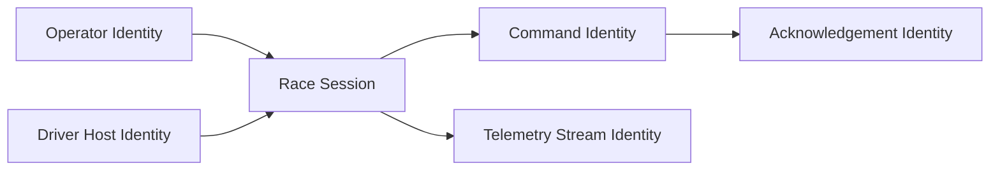
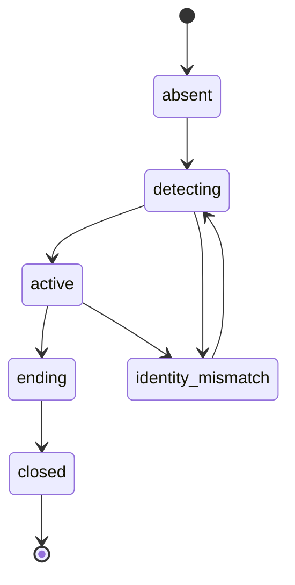

# AVM Race Engineer Session And Identity Model

Status: DRAFT

This document proposes the F0 model for session authority, operator identity,
and driver-host identity across AVM Race Engineer.

Related documents: [Component Boundaries](component-boundaries.md),
[Data Flow](data-flow.md), [Offline And Reconnect Model](offline-and-reconnect-model.md),
[Security Boundaries](../operations/security-boundaries.md),
[Support And Diagnostics](../operations/support-and-diagnostics.md).

## Proposed Identity Domains

- `driver-host identity`: the bridge-side identity representing a specific edge
  machine in a race session.
- `operator identity`: the authenticated human actor using `Engineer Console`.
- `session identity`: the active race or stint context against which telemetry,
  commands, and audit events are correlated.
- `command identity`: the unique instance identifier for a driver-visible
  action, including expiry and acknowledgement state.

## Proposed Identity Relationships

## Proposed Authority Rules

- The relay should be the authority for binding operator actions to the active
  race session.
- The relay should validate that a bridge connection is associated with the
  intended driver-host identity before accepting session data as authoritative.
- Command issuance should always be attributable to one operator identity, even
  when multiple browser tabs are active.
- The bridge should correlate acknowledgements to existing command identities
  rather than minting independent driver-visible command state.

## Proposed Session Lifecycle

In `active`, operator and driver-host identities attach with scoped roles and
all telemetry, command, and audit events correlate to the relay-side session
identity. `ending` closes command issuance before retention begins.

## Proposed Identity Risks

| Risk | Why it matters | Proposed control direction |
| --- | --- | --- |
| shared generic edge credentials | weak attribution and revocation | distinct driver-host identity per edge machine |
| unaudited operator actions | no reliable post-incident review | relay-side audit with operator correlation |
| stale browser tab acting on old session | commands could target wrong context | explicit active-session validation before dispatch |
| reconnect under ambiguous host identity | telemetry trust collapse | reject or quarantine until identity is re-established |

## Open F0 Questions

- Whether driver-host identity is long-lived across events or race-weekend
  scoped.
- Whether operators need separate identities for read-only versus command
  issuance roles from day one.
