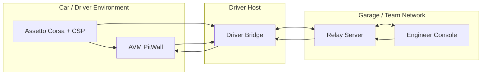

# AVM Race Engineer System Context

Status: DRAFT

This document proposes an F0 system context for AVM Race Engineer. It defines
the major surfaces, intended data flow, and the boundaries that later design
and implementation work should preserve. It does not claim an implemented
transport, SDK surface, or deployment detail.

Related documents: [Component Boundaries](component-boundaries.md),
[Data Flow](data-flow.md), [Deployment Topology](deployment-topology.md),
[Session And Identity Model](session-and-identity-model.md),
[Offline And Reconnect Model](offline-and-reconnect-model.md),
[Observability](observability.md),
[Security Boundaries](../operations/security-boundaries.md),
[On-Prem Deployment](../operations/on-prem-deployment.md).

## Proposed Components

- `AVM PitWall` is the in-car CSP Lua client surface for compact driver-facing
  status, acknowledgements, and limited command display. It should consume a
  bounded driver snapshot rather than host the full race-model or forecast
  engine.
- `Driver Bridge` is the Windows host-side collector and uplink coordinator for
  telemetry, local buffering, client identity, low-latency current-state
  calculation, and short-horizon forecasting on the driver machine.
- `Relay Server` is the proposed on-prem coordination point for session state,
  telemetry fan-out, command routing, audit capture, operator access control,
  and longer-horizon scenario evaluation.
- `Engineer Console` is the proposed browser console for telemetry inspection,
  strategy input, acknowledgements, operator visibility, and forecast
  inspection. It should not become the authoritative owner of production
  calculations.

## Proposed Context Diagram

## Proposed External Actors

- `Driver` interacts with the in-car `AVM PitWall` surface under racing
  conditions where distraction cost is high.
- `Race Engineer` and other team operators use `Engineer Console` from the pit wall
  or garage network.
- `Team Infrastructure Operator` is responsible for provisioning, monitoring,
  and recovering the relay-side services on team-controlled infrastructure.
- `Assetto Corsa + CSP` should be treated as an external simulation runtime and
  telemetry source, not as a trusted authority for platform identity or audit
  behavior.

## Proposed Data And Control Paths

- Telemetry originates from the game and is expected to enter the platform
  through the `Driver Bridge`.
- The bridge should keep measured telemetry, derived current state, forecast
  state, and recommendation state as separate layers instead of collapsing them
  into one generic payload.
- Baseline strategy, current accepted strategy revision, live forecast, and
  engineer-proposed revisions should remain distinct records so live
  calculations cannot silently overwrite the plan.
- `Driver Bridge` should combine local telemetry, race identity, accepted
  strategy revision, and weather inputs into an authoritative low-latency
  current-state and short-horizon forecast stream for the active car.
- `Relay Server` should accept both raw and calculated bridge state, validate
  compatibility and identity, optionally recompute with the same shared domain
  libraries, and expose richer longer-horizon scenarios to the browser.
- Driver-visible prompts should be derived from a bounded command model instead
  of free-form remote rendering.
- Driver-visible race context should be delivered as a compact driver snapshot
  with current action, fuel or stint state, weather implication, confidence,
  and freshness rather than a full engineer-grade model.
- Engineer actions should flow through the `Relay Server` so command intent,
  acknowledgement state, and audit events remain consistent.
- Engineer-authored inputs should flow through the relay as proposed revisions,
  overrides, or scenario requests; the browser should visualize results but not
  become an independent authority for session truth.
- Historical views should be derived from persisted relay-side session data
  rather than the transient in-car display state.

## Architectural Constraints

- The in-car Lua surface should be treated as resource-constrained and
  interruption-prone.
- The driver host may temporarily lose upstream connectivity while the local
  game session continues.
- The driver host should continue local calculation and compact snapshot
  publication during relay outages, while clearly separating local live truth
  from remote stale or unavailable state.
- The relay tier should remain deployable on a private team-controlled network
  without requiring a public cloud dependency for core race operations.
- The engineer surface should clearly separate live, stale, and historical
  information so operators do not act on ambiguous data.
- Weather provenance should remain explicit. Current measurements, scheduled
  controller data, AVM-derived trends, estimated forecasts, and unknown future
  state should not be presented as interchangeable evidence.

## F0 Architectural Priorities

- Preserve driver safety by constraining remote-to-driver rendering paths.
- Preserve operator trust by making freshness and authority explicit.
- Preserve race-day operability on private team-controlled networks.
- Preserve auditability for command issuance, acknowledgement, and recovery.

## Out Of Scope For This Draft

- Exact wire protocol selection.
- Exact persistence engine selection.
- Exact browser authentication provider selection.
- Exact CSP API calls or capabilities beyond the presence of a Lua client
  surface described in the repository README.
