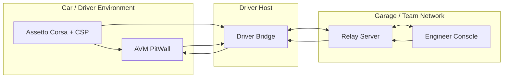

# AVM Race Engineer System Context

Status: DRAFT

This document proposes an F0 system context for AVM Race Engineer. It defines
the major surfaces, intended data flow, and the boundaries that later design
and implementation work should preserve. It does not claim an implemented
transport, SDK surface, or deployment detail.

Related documents: [Component Boundaries](component-boundaries.md),
[Data Flow](data-flow.md), [Deployment Topology](deployment-topology.md),
[Session And Identity Model](session-and-identity-model.md),
[Offline And Reconnect Model](offline-and-reconnect-model.md),
[Observability](observability.md),
[Security Boundaries](../operations/security-boundaries.md),
[On-Prem Deployment](../operations/on-prem-deployment.md).

## Proposed Components

- `AVM PitWall` is the in-car CSP Lua client surface for compact driver-facing
  status, acknowledgements, and limited command display.
- `Driver Bridge` is the Windows host-side collector and uplink coordinator for
  telemetry, local buffering, and client identity on the driver machine.
- `Relay Server` is the proposed on-prem coordination point for session state,
  telemetry fan-out, command routing, audit capture, and operator access
  control.
- `Engineer Console` is the proposed browser console for telemetry inspection,
  strategy input, acknowledgements, and operator visibility.

## Proposed Context Diagram

## Proposed External Actors

- `Driver` interacts with the in-car `AVM PitWall` surface under racing
  conditions where distraction cost is high.
- `Race Engineer` and other team operators use `Engineer Console` from the pit wall
  or garage network.
- `Team Infrastructure Operator` is responsible for provisioning, monitoring,
  and recovering the relay-side services on team-controlled infrastructure.
- `Assetto Corsa + CSP` should be treated as an external simulation runtime and
  telemetry source, not as a trusted authority for platform identity or audit
  behavior.

## Proposed Data And Control Paths

- Telemetry originates from the game and is expected to enter the platform
  through the `Driver Bridge`.
- Driver-visible prompts should be derived from a bounded command model instead
  of free-form remote rendering.
- Engineer actions should flow through the `Relay Server` so command intent,
  acknowledgement state, and audit events remain consistent.
- Historical views should be derived from persisted relay-side session data
  rather than the transient in-car display state.

## Architectural Constraints

- The in-car Lua surface should be treated as resource-constrained and
  interruption-prone.
- The driver host may temporarily lose upstream connectivity while the local
  game session continues.
- The relay tier should remain deployable on a private team-controlled network
  without requiring a public cloud dependency for core race operations.
- The engineer surface should clearly separate live, stale, and historical
  information so operators do not act on ambiguous data.

## F0 Architectural Priorities

- Preserve driver safety by constraining remote-to-driver rendering paths.
- Preserve operator trust by making freshness and authority explicit.
- Preserve race-day operability on private team-controlled networks.
- Preserve auditability for command issuance, acknowledgement, and recovery.

## Out Of Scope For This Draft

- Exact wire protocol selection.
- Exact persistence engine selection.
- Exact browser authentication provider selection.
- Exact CSP API calls or capabilities beyond the presence of a Lua client
  surface described in the repository README.
