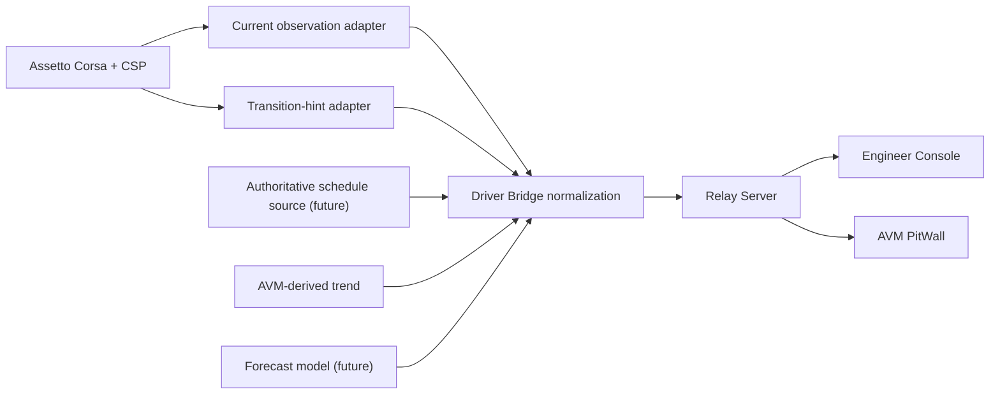

# AVM Race Engineer Weather Forecast Architecture

Status: DRAFT

This document proposes how AVM Race Engineer should separate current weather,
transition hints, authoritative future schedules, and estimated forecasts. The
goal is to prevent the platform from presenting a future-weather claim with
more certainty than the underlying source can justify.

Related documents:
[weather source selection](weather-source-selection.md),
[weather capabilities](../research/weather-capabilities.md),
[weather source capability matrix](../research/weather-source-capability-matrix.md),
[CSP weather probe plan](../research/csp-weather-probe-plan.md),
[telemetry capability matrix](../research/telemetry-capability-matrix.md).

## Proposed Weather Lanes

The platform should treat weather as seven distinct evidence classes:

| Lane | Meaning | Example source | Operator label |
| --- | --- | --- | --- |
| Current weather observation | Direct measured atmospheric state | `ac.getSim()` current fields | Current |
| Current track-condition observation | Direct measured surface state | wetness, standing water, road grip | Current |
| Transition hint | A single next-type hint and scalar transition progress | `weatherConditions.upcomingType` plus `transition` | Transition hint |
| Scheduled future | Future plan from an authoritative source | future server/plugin/controller feed | Scheduled |
| Derived trend | Direction and rate calculated from compatible recent observations | AVM rolling wetting/drying trend | Trending |
| Estimated future | Model output derived from observations and assumptions | AVM forecast model | Estimated |
| Unknown future | No compatible or sufficiently fresh future evidence | no provider or failed provider | Unknown |

The critical rule is that data must not move from one lane to another without
an explicit transform. In particular, a transition hint must not be promoted to
an authoritative schedule.

## Proposed Data Flow

## Proposed Ownership Rules

### Driver Bridge

- Normalize every adopted weather input into a versioned weather envelope.
- Attach source identity, capture time, freshness, and confidence metadata.
- Keep current weather, current track condition, transition hint, scheduled,
  derived trend, estimated, and unknown lanes separate.
- Reject silent promotion of a hint into a schedule.

## Provider Abstractions

Provider boundaries should keep retrieval and provenance separate from
aggregation and display:

- `CurrentConditionsProvider` supplies measured current weather and track
  condition.
- `ControllerTransitionProvider` supplies only a controller-provided
  current-to-next hint and transition progress.
- `AuthoritativeScheduleProvider` supplies a deliberately exposed future
  schedule.
- `DerivedTrendProvider` calculates recent measured direction without claiming
  schedule authority.
- `EstimatedForecastProvider` produces modelled future conditions with
  uncertainty and horizon-dependent confidence.

A missing or failed provider produces an explicit unknown or stale state; the
aggregator must not substitute another provider's provenance label.

## Cadence Hypotheses

These are starting points for F3A measurement, not final rates:

| Activity | Initial proposal |
| --- | --- |
| raw current-condition capture | approximately `1 Hz`, with source-native event changes preserved |
| local trend update | every `5–15 seconds` when enough compatible history exists |
| authoritative schedule ingestion | on provider update, reconnect, controller change, and periodic freshness check |
| forecast recalculation | immediately on meaningful regime/source/strategy change and periodically while stable |
| driver snapshot publication | bounded low-rate updates plus immediate significant weather-regime events |
| Engineer Console publication | on material model change with access to underlying detail |
| browser rendering | independently throttled from publication; it never sets calculation cadence |
| historical recording | preserve current measurements and source transitions at a measured, storage-budgeted cadence |

The five-minute driver and engineer timeline is a display/resampling cadence,
not the capture, calculation, publication, or recording cadence. The broader
transport estimate remains a capacity-planning envelope; F3A must measure the
rates before an ADR can make them final.

### Relay Server

- Fan out weather envelopes with source metadata preserved.
- Keep auditability for schedule changes, model revisions, and stale-state
  transitions.
- Avoid deriving authoritative future truth from partial browser state.

### Engineer Console

- Present richer provenance, age, and confidence detail.
- Show when future weather is unknown, stale, contradictory, or estimated.
- Allow operators to compare current observations against future claims without
  merging them into one label.

### AVM PitWall

- Present compact driver-safe language such as `CURRENT RAIN`, `RAIN TRENDING`,
  or `RAIN SCHEDULED`.
- Use a clock-specific time only for `Scheduled` sources. An `Estimated`
  source may show an uncertainty-aware range such as `8–12 minutes` when its
  model, confidence, and provenance are explicit; a transition hint alone
  cannot justify an ETA.
- Fall back to `Unknown` or current-only messaging when future evidence is
  absent or stale.

## Proposed Envelope Shape

Every weather payload should carry:

- `source_id`
- `source_lane`
- `capture_time_utc`
- `sample_age_ms`
- `session_id`
- `car_id` when the scope is car-local
- `csp_build` or source-build identity when known
- `confidence`
- `current` fields
- optional `transition_hint`
- optional `scheduled_future`
- optional `estimated_future`

`transition_hint` should remain intentionally narrow:

- `current_type`
- `upcoming_type`
- `transition_progress`
- optional raw rain or track-state fields that belong to the same sampled
  structure

That narrow shape prevents consumers from inferring a forecast horizon or full
multi-step schedule that the source never supplied.

## Evidence-Based Constraints

- Generic CSP apps document current fields and a filtered
  `weatherConditions` structure at
  `E:\Games\Steam\steamapps\common\assettocorsa\extension\internal\lua-sdk\ac_apps\lib.lua:5295-5304,5365-5383`.
- `ac.ConditionsSet` documents `currentType`, `upcomingType`, and `transition`
  at the same SDK in `ac_apps/lib.lua:7544-7558`.
- Weather mutation is documented only for the WeatherFX controller surface at
  `ac_wfx_controller/lib.lua:9598-9607`.
- `ac.connect()` remains a Lua-to-Lua shared-structure surface with matched
  layouts and script-type restrictions at `ac_apps/lib.lua:7161-7182`.
- Memory-mapped files are the only inspected surface that explicitly mentions a
  separate process at `ac_apps/lib.lua:7424-7429`.

## Safety Rules

- Do not show a clock-based rain arrival claim from `transition` alone.
- Do not show a multi-step weather timeline without a source that actually
  publishes one.
- Do not overwrite current observations with future estimates.
- Do not let browser-side caches invent source truth after reconnect.
- Do not present local-only fallback data as relay-confirmed session truth.
