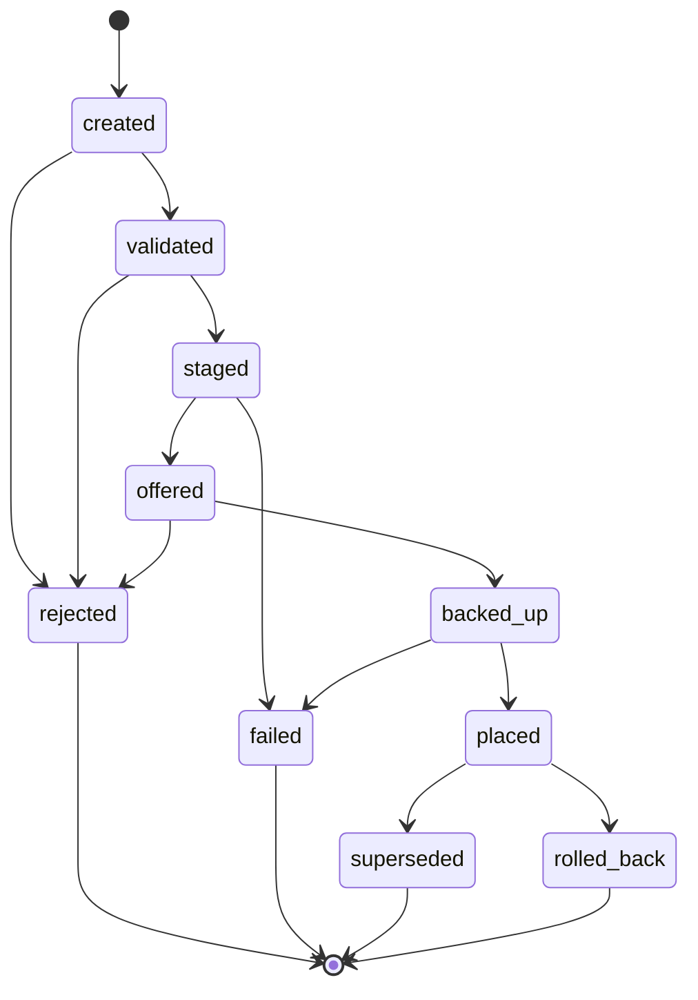

# Setup Transfer v0

**DRAFT — NOT IMPLEMENTED — SUBJECT TO CHANGE**

## Purpose

Defines the F0 setup-transfer contract for packaging, staging, reviewing, and manually loading a setup. This is a contract draft only; it does not claim any import or application path is implemented across `Engineer Console`, relay, bridge, or in-car surfaces.

## Exact Metadata Fields

The transfer metadata must contain these exact fields:

- `setup_id`
- `revision`
- `car_id`
- `track_id`
- `layout_id`
- `filename`
- `checksum`
- `size`
- `engineer`
- `notes`
- `creation_time`
- `compatibility`
- `superseded_setup_id`

## Transfer Shape

- `schema_version` identifies the setup-transfer contract version.
- `transfer_id` identifies the logical transfer attempt.
- `session_id` scopes the transfer to one active session.
- `metadata` carries the exact metadata fields listed above.
- `staging_state` records lifecycle state without allowing a remote party to
  choose a local filesystem path. Driver Bridge derives and confines the
  staging directory locally.
- `file_extension` captures the staged file extension so extension checks can reject obviously wrong payloads.
- `requires_garage_consent` declares whether the setup must only be offered while the car is safely in the garage or an equivalent no-risk state.
- `requires_manual_ingame_load` declares that the final load step still needs a human action inside the game or CSP UI path.
- `backup_before_placement` and `rollback_supported` define the filesystem
  safety posture.
- `idempotency_key` prevents duplicate staging records.
- `payload` carries the setup body or structured transfer artifact.

## Staged Lifecycle

Suggested staged lifecycle for one logical transfer:

This lifecycle is descriptive only; it is not yet a separate schema artifact.

## Validation And Safety Rules

- `checksum`, `size`, basename-only `filename`, and allowlisted
  `file_extension` must be checked before the setup is offered for placement.
- Wrong-car or wrong-track/layout matches must end in rejection, not silent best-effort import.
- `backup_before_placement = true` means the previous destination file should
  be preserved before the bridge copies the accepted setup into the Assetto
  Corsa setup directory.
- `rollback_supported = true` means the prior backup can be restored after a
  failed or rejected placement flow.
- `requires_garage_consent = true` means the transfer must not be surfaced as ready-to-load while the car is on track.
- `requires_manual_ingame_load = true` means the contract explicitly assumes the last-mile load step is manual inside the game.
- `placed` means copied to the approved directory; it never means silently
  loaded into the active car.

## Null And Missing Semantics

- `notes` and `superseded_setup_id` may be `null`, but the fields themselves must remain present.
- `layout_id` may be `null` if the track has no separately modeled layout identifier, but the field must remain present.
- Unknown setup-body keys inside `payload` should be preserved for audit even when ignored by a recipient.

## Schema

Authoritative draft schema: [setup-transfer-v0.schema.json](./setup-transfer-v0.schema.json)
