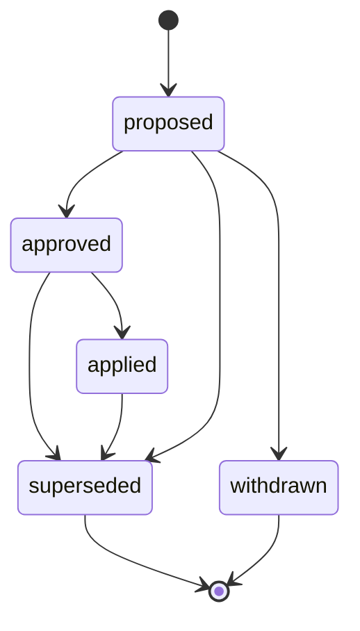

# Strategy Revision v0

**DRAFT — NOT IMPLEMENTED — SUBJECT TO CHANGE**

## Purpose

Defines the logical revision contract for strategy recommendations, plans, and operator overrides. This is a revisioning and audit document only; it does not claim any live strategy engine exists.

## Revision Model

- Each strategy update belongs to one `session_id` and one `car_id`.
- A strategy object must expose a stable `strategy_id` and a monotonic `revision`.
- A later revision supersedes earlier revisions for the same `strategy_id` but must remain historically auditable.

## Required Semantics

- Strategy revisions may be `proposed`, `approved`, `applied`, `superseded`, or `withdrawn`.
- Derived strategy outputs must preserve upstream evidence references where possible.
- Operator overrides must never erase the prior machine-generated or manual recommendation; they create a new revision instead.
- No remote revision may silently replace the driver's active plan. Driver
  review or explicit consent is required wherever the revision changes the
  active in-car strategy.

## Freshness And Expiry

- Every revision should carry an observation window or `valid_until` timestamp even if the exact field names are still open.
- A stale revision may remain visible for audit but must not silently displace a fresher approved revision.

## Wrong-Session And Wrong-Car Handling

- Strategy revisions for the wrong session or car must be rejected from the active planning surface.
- Manual recovery or forensic tooling may still display them outside the active control path.

## Audit Expectations

- Audit should capture author, evidence basis, approval actor if any, and supersession reason.
- Replaying the history must make it possible to see what recommendation existed before a human override.
