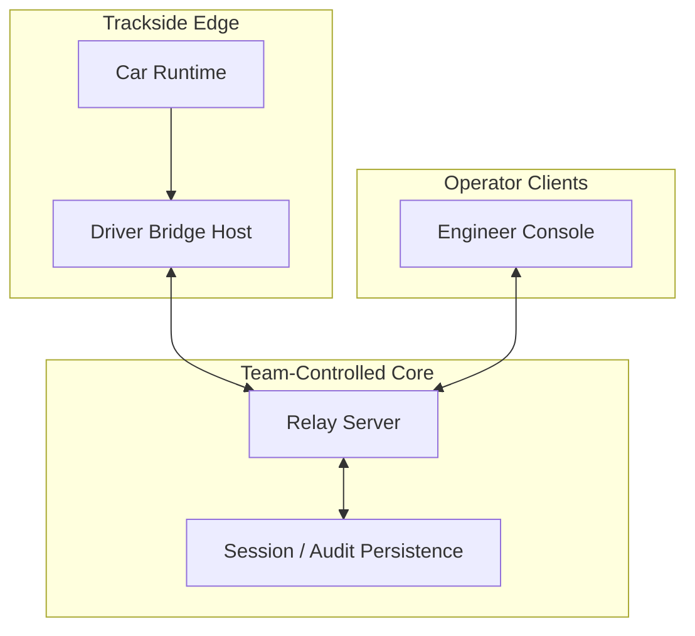

# AVM Race Engineer On-Prem Deployment

Status: DRAFT

This document proposes the F0 operational deployment model for running AVM Race
Engineer on team-controlled infrastructure.

Related documents: [Deployment Topology](../architecture/deployment-topology.md),
[Offline And Reconnect Model](../architecture/offline-and-reconnect-model.md),
[Retention And Backups](retention-and-backups.md),
[Support And Diagnostics](support-and-diagnostics.md).

## Proposed Deployment Topology

## Proposed Deployment Principles

- Core race functionality should remain viable on a private team network
  without requiring public internet connectivity.
- Relay and persistence should be treated as team-controlled operational assets.
- Browser clients should reconnect to relay truth rather than acting as durable
  stores.
- Recovery should favor fast restoration of authoritative session state before
  reopening sensitive command paths.

## Proposed Recovery Sequence

1. Re-establish relay availability and confirm the active session identity.
2. Verify bridge reconnect and current freshness state.
3. Reconcile delayed telemetry before declaring the stream `live`.
4. Reopen command dispatch only after expiry and deduplication behavior is
   healthy.
5. Record the outage and recovery milestones in audit-visible form.

## Proposed Failure Matrix

| Failure case | Expected F0 behavior |
| --- | --- |
| bridge loses relay connectivity | bridge buffers within limits and marks session degraded |
| relay restarts | bridges and browsers reconnect and revalidate freshness |
| browser tab sleeps | browser rehydrates from relay truth and does not trust cached state blindly |
| persistence path fails | history claims degrade visibly and recovery posture tightens |
| command expires during outage | expired command remains closed and is not replayed to driver display |

## Open Operational Questions

- Whether F0 needs a warm standby relay or only a restart-oriented recovery
  posture.
- Whether observer-only client surfaces should remain available during command
  path restrictions.
