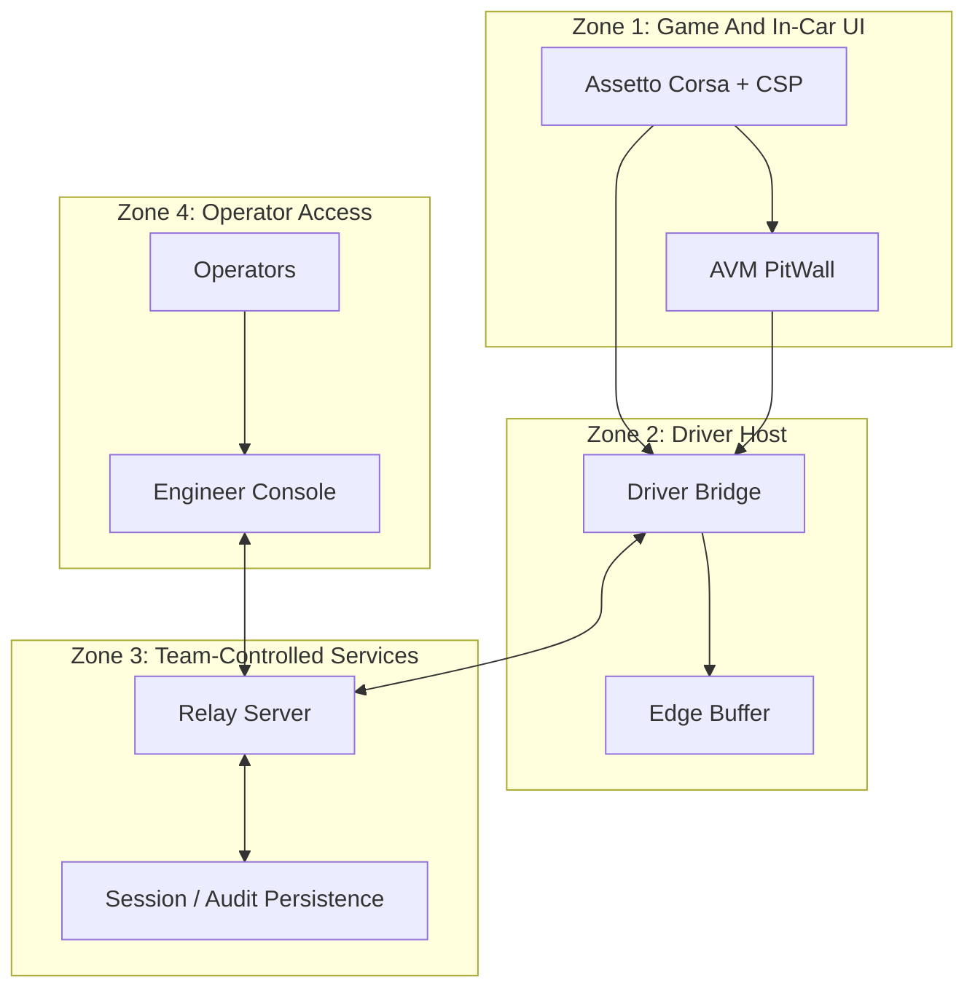

# AVM Race Engineer Security Boundaries

Status: DRAFT

This document proposes the F0 operational security boundary model for AVM Race
Engineer. It focuses on trust zones, identity, command safety, render
protection, outage posture, and operator account risk.

Related documents: [Component Boundaries](../architecture/component-boundaries.md),
[Session And Identity Model](../architecture/session-and-identity-model.md),
[Offline And Reconnect Model](../architecture/offline-and-reconnect-model.md),
[Support And Diagnostics](support-and-diagnostics.md).

## Proposed Trust Zones

## Proposed Boundary Assumptions

- `Zone 1` is operationally sensitive and should receive bounded local view
  state only.
- `Zone 2` is semi-trusted and may buffer telemetry temporarily, but it should
  not carry unrestricted team-wide authority.
- `Zone 3` is the authority boundary for authorization, auditability, and
  authoritative session truth.
- `Zone 4` is trusted only after explicit operator authentication within the
  active race context.

## Proposed Security Rules

### Identity

- Driver hosts should present distinct bridge identities rather than a shared
  generic credential.
- Operators should be attributable individually for command issuance and
  sensitive session actions.
- Team and session isolation should be enforced at the relay so one operator or
  edge identity cannot implicitly read or act across unrelated sessions.

### Authentication And Authorization

- Operator authentication should be explicit and revocable.
- Role-based authorization should be evaluated by the relay before any session
  view or command capability is granted.
- Read access to telemetry, command history, and session metadata should be
  scoped by team and active session, not treated as globally readable once a
  user signs in.
- Session selection should be revalidated before privileged actions so a stale
  browser tab cannot silently act on the wrong race context.

### Token Lifecycle

- Driver-host and operator tokens should be distinct classes with different
  privileges and revocation expectations.
- Token issuance should be time-bounded and should support rotation after leak
  suspicion, operator offboarding, or race-weekend teardown.
- A compromised or leaked driver/session token should not grant broad
  operator-console authority.
- A reconnecting client should prove current session identity rather than rely
  only on cached browser or edge state.

### Render Safety

- Driver-visible rendering should come from enumerated templates and bounded
  text fields.
- Browser-visible telemetry and message content should be treated strictly as
  data, not as executable markup.
- Browser content should be treated as a compromise target: operator account
  takeover, malicious session content, and injected browser state should all be
  assumed possible in the threat model.

### Command Safety

- Commands should carry type, origin, recipient, and expiry metadata.
- The relay should reject malformed, expired, unauthorized, or ambiguous
  commands before they reach the edge.
- Reconnect handling should prefer idempotent command correlation to prevent
  duplicate driver prompts.
- The relay should treat replayed, duplicated, stale, wrong-car, and
  wrong-session commands as distinct rejection cases that remain audit-visible.

### Transport And Secret Handling

- Relay-facing traffic should require transport protection; missing TLS or an
  insecure websocket posture should be treated as a deployment defect, not an
  acceptable race-day shortcut.
- Secrets should be excluded from routine logs, operator-visible diagnostics,
  and support bundles unless a narrowly controlled incident workflow requires
  them.
- Long-lived secrets should not be embedded into hand-moved setup artifacts or
  free-form local configuration paths.

### Offline And Outage Posture

- Server, internet, and persistence outages should degrade visibility and
  command authority explicitly rather than silently widening trust.
- Offline behavior should preserve the distinction between last-known state and
  currently authenticated live authority.

## Proposed Boundary Risks And Controls

| Boundary | Primary risk | Proposed F0 control |
| --- | --- | --- |
| game to bridge | malformed or noisy telemetry | versioned schema validation before fan-out |
| web to relay | unauthorized operator action | authenticated session and race-scoped authorization |
| relay to bridge | unsafe driver payload | bounded command model with expiry and acknowledgement rules |
| bridge local buffer | leakage of sensitive race data | minimal retention and deliberate cleanup |
| browser cache | stale state acted on as live | explicit freshness revalidation on reconnect |

## Threat Coverage Matrix

| Threat | Proposed MVP control direction | Later-hardening direction |
| --- | --- | --- |
| unauthorized engineer or session viewing | relay-authenticated access plus team/session scoping | finer-grained least-privilege roles and anomaly detection |
| compromised or leaked driver/session token | short-lived scoped token classes and revocation path | stronger device binding and automated rotation |
| replay, duplicate, stale, wrong-car, or wrong-session commands | command identity, expiry, recipient metadata, and relay-side rejection | richer deduplication windows and policy analytics |
| tampering or impersonation on edge or operator paths | explicit identity checks and audit-visible mismatches | stronger attestation and higher-assurance provisioning |
| malicious setup path, path traversal, or arbitrary file placement | constrained setup locations and reject-by-default packaging rules | signed packages and stricter installer validation |
| server, internet, or database outages | explicit degraded/offline state and restricted authority | standby/failover patterns and automated recovery drills |
| secrets exposed in logs or support bundles | default redaction and least-data diagnostic collection | centralized secret scanning and export policy enforcement |
| missing TLS or insecure websocket transport | deployment gate that treats insecure transport as non-compliant | certificate lifecycle automation and continuous posture checks |
| retention over-collection or weak cleanup | bounded retention and deliberate cleanup policy | policy-driven retention enforcement across stores |
| browser content or operator account compromise | server-side authz, bounded rendering, and session revalidation | stronger account protection and suspicious-session response |

## Proposed Audit And Retention Notes

- Every accepted or rejected privileged action should remain attributable to an
  operator or edge identity where possible.
- Security-relevant events should include enough correlation detail to support
  post-incident reconstruction without requiring raw secrets in logs.
- Retention detail is defined further in
  [Retention And Backups](retention-and-backups.md) and should be kept aligned
  with the threat model.

## Proposed MVP Versus Later Controls

- F0 MVP should prioritize explicit authentication, role-based authorization,
  team/session isolation, token rotation capability, TLS-required transport,
  bounded driver rendering, audit trails, and safe degraded offline behavior.
- Later iterations may add stronger device attestation, automated secret
  rotation, richer anomaly detection, and more advanced account-protection
  measures.
