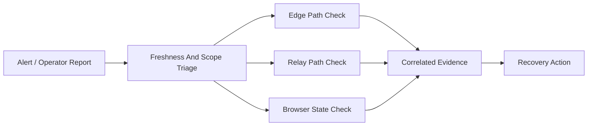

# AVM Race Engineer Support And Diagnostics

Status: DRAFT

This document proposes the F0 support and diagnostics model for race-day and
post-incident troubleshooting.

Related documents: [Observability](../architecture/observability.md),
[Offline And Reconnect Model](../architecture/offline-and-reconnect-model.md),
[Session And Identity Model](../architecture/session-and-identity-model.md),
[Security Boundaries](security-boundaries.md).

## Proposed Diagnostic Priorities

1. Determine whether the issue is `live`, `degraded`, `stale`, or
   `disconnected`.
2. Determine whether the fault is edge-side, relay-side, persistence-side, or
   browser-only.
3. Preserve correlation identifiers and audit evidence before manual
   intervention.
4. Restore the authoritative relay path before retrying sensitive commands.

## Proposed Diagnostic Signals

- session freshness state and last-event age
- bridge reconnect count and current buffering state
- relay availability and persistence health
- operator identity, active session, and recent authorization outcomes
- command correlation identifiers and acknowledgement timeline

## Proposed Support Workflow

## Proposed Incident Questions

- Is the stream actually live, or is a stale browser view creating the symptom?
- Is the bridge disconnected from the relay while still connected to the game?
- Did the relay reject a command for authorization, expiry, or identity reasons?
- Is the issue limited to one driver host, one operator client, or the whole
  session?

## Proposed Packaging Guidance

- Support bundles should include correlation identifiers, freshness state, and
  recent command transitions.
- Support bundles should avoid collecting more driver-host local history than is
  necessary for diagnosis.
- Manual operator notes about race context should remain attachable to the
  incident record without mutating the raw audit trail.
